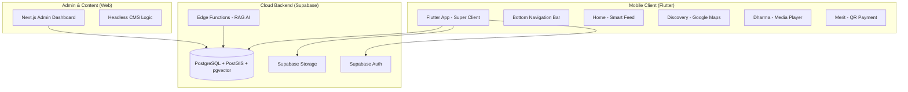
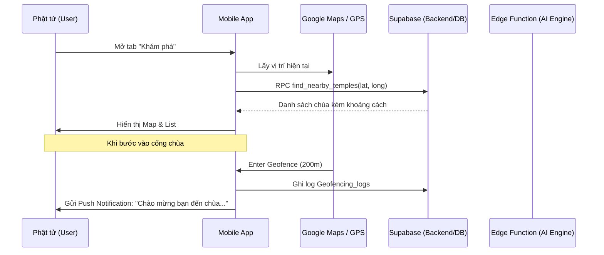

# Chiến lược Hệ sinh thái Phật giáo Đa nền tảng (Master Blueprint)

Tài liệu này là bản quy hoạch tổng thể cấp cao nhất, kết hợp giữa Web Admin (Next.js) và Mobile App (Flutter) tích hợp công nghệ AI và GIS. Đây là tài liệu gốc để triển khai kỹ thuật và bảo vệ **Đồ án Tốt nghiệp (ĐATN)** mức độ Xuất sắc.

---

## 1. Kiến trúc Hệ thống Tổng thể (Comprehensive Architecture)

Kiến trúc được xây dựng theo mô hình **Headless CMS & Multi-tenant Super Client**, sử dụng Supabase làm trái tim dữ liệu (Single Source of Truth).



---

## 2. Chi tiết Phân hệ & Tính năng Cốt lõi

### **A. Khám phá & GIS (Discovery System)**
Sử dụng công nghệ **PostGIS** để xử lý không gian thực tế:
- **Tìm chùa gần nhất:** Sử dụng Index GIST để truy vấn khoảng cách cực nhanh (O(1)).
- **Geofencing & Automation:** 
    - Khi nhận diện User trong bán kính 200m của chùa, thiết bị kích hoạt `Push Notification`.
    - Tự động hiển thị `Sơ đồ kiến trúc` và `Lịch hành lễ` của chùa đó ngay lập tức.

### **B. Người thầy số (AI Dharma Bot - RAG Logic)**
Đây là tính năng đột phá sử dụng **Retrieval-Augmented Generation (RAG)**:
1. **Pre-processing:** Toàn bộ nội dung Pháp thoại (Text/Audio) được cắt nhỏ (Chunks) -> Vectorize (Embedding) -> Lưu vào `pgvector`.
2. **Querying:** Khi Phật tử hỏi, hệ thống tìm kiếm nội dung tương đồng cơ sở nhất (Cosine Similarity) -> Truyền ngữ cảnh cho AI (Gemini) -> Trả lời chính xác theo quan điểm Phật giáo Nam Tông.

### **C. Phước điền & Minh bạch (Merit Gateway)**
- **VietQR Động:** Mã QR tự động chứa `Mã định danh dự án` và `Tenant ID`.
- **Sổ cái Minh bạch (Public Ledger):** Hiển thị thời gian thực các đóng góp đã được Admin duyệt trên Web, tăng niềm tin cho Phật tử.

---

## 3. Thiết kế Kỹ thuật Chuyên sâu (Technical Deep-Dive)

### **1. Quy trình User Journey (Sequence Diagram)**



### **2. Đề xuất Migration Database (Mobile & AI Ready)**

```sql
-- 1. Kích hoạt PostGIS & Vector
CREATE EXTENSION IF NOT EXISTS postgis;
CREATE EXTENSION IF NOT EXISTS vector;

-- 2. Nâng cấp bảng Tenants (Địa lý)
ALTER TABLE tenants ADD COLUMN geog GEOGRAPHY(POINT);
CREATE INDEX idx_tenants_geog ON tenants USING GIST (geog);

-- 3. Bảng Embedding hỗ trợ AI Bot
CREATE TABLE dharma_embeddings (
  id UUID PRIMARY KEY DEFAULT uuid_generate_v4(),
  tenant_id UUID REFERENCES tenants(id),
  content_text TEXT,
  embedding vector(1536), -- Phù hợp với Gemini/OpenAI
  metadata JSONB
);
```

---

## 4. Đề cương Đồ án Tốt nghiệp (Graduation Thesis Proposal)

**Tên đề tài:** Hệ sinh thái Quản lý và Phát triển Văn hóa Chùa Khmer Đa nền tảng (Web & Mobile) tích hợp AI (RAG) và GIS.

**Tính cấp thiết:**
- Hiện đại hóa việc lưu giữ văn hóa Khmer trong kỷ nguyên số.
- Giải quyết bài toán minh bạch tài chính trong phước điền.
- Ứng dụng công nghệ mới nhất (AI/GIS) vào đời sống tâm linh.

**Cấu trúc Đồ án:**
- **Chương 1:** Tổng quan về văn hóa Khmer và nhu cầu chuyển đổi số.
- **Chương 2:** Cơ sở lý thuyết (Multi-tenancy, Headless Architecture, RAG, PostGIS).
- **Chương 3:** Phân tích, thiết kế hệ thống và cấu trúc dữ liệu.
- **Chương 4:** Thực nghiệm triển khai (Web Admin & Flutter App).
- **Chương 5:** Đánh giá hiệu năng và hướng phát triển (AR/Metaverse).

---

## 5. Lộ trình Triển khai (Roadmap)

1. **Tuần 1-2:** Hoàn thiện Web Core, chuẩn hóa Schema đa thuê bao (Multi-tenant) - **[DONE]**.
2. **Tuần 3-4:** Khởi tạo Flutter Project, tích hợp Google Maps & PostGIS Query.
3. **Tuần 5-6:** Phát triển AI RAG Pipeline & Thư viện Pháp thoại.
4. **Tuần 7-8:** Tích hợp VietQR, kiểm thử toàn diện và đóng gói báo cáo.

---

## 6. Ngôn ngữ UX/UI: "Premium Zen"
- **Triết lý:** "Thanh tịnh - Hiện đại - Chân thực".
- **Visuals:** Sử dụng hiệu ứng mờ chồng lớp (Glassmorphism), màu sắc Saffron (Vàng nghệ), Brown (Cánh dán) và Bone White.
- **Micro-interactions:** Hiệu ứng chuyển động hữu cơ, tạo cảm giác thư thái khi sử dụng.

---
*Tài liệu này được kế thừa và tổng hợp toàn bộ tri thức từ các tệp thiết kế chi tiết (Files 14-17).*
*Cập nhật lần cuối: 16/03/2026 bởi Antigravity AI*
