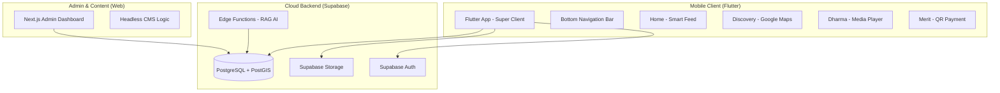

# Kế hoạch chi tiết: Hệ sinh thái Ứng dụng Di động (Mobile App Ecosystem)

Dự án này mở rộng nền tảng Web hiện tại thành một hệ sinh thái đa kênh (Cross-platform), lấy dữ liệu từ Supabase làm hướng tâm (Single Source of Truth).

---

## 1. Kiến trúc Hệ thống (System Architecture)

---

## 2. Thiết kế Cơ sở Dữ liệu (Database Schema Extensions)

Để hỗ trợ tính năng **Khám phá (Discovery)** và **Địa lý (Geofencing)**, cần mở rộng bảng `tenants`:

| Trường (Field) | Kiểu dữ liệu | Mô tả |
| :--- | :--- | :--- |
| `latitude` | `FLOAT8` | Vĩ độ thực tế của chùa |
| `longitude` | `FLOAT8` | Kinh độ thực tế của chùa |
| `geog` | `GEOGRAPHY(POINT)` | Kiểu dữ liệu PostGIS để truy vấn bán kính nhanh |
| `address_vi` | `TEXT` | Địa chỉ chi tiết |
| `province_id` | `UUID` | Liên kết đến bảng tỉnh thành để lọc |

---

## 3. Chi tiết các Phân hệ chức năng

### **A. Khám phá (Discovery - Map & GPS)**
- **Công nghệ:** Google Maps SDK for Flutter + PostGIS.
- **Tính năng ĐATN:** 
    - Truy vấn SQL "Chùa gần tôi" sử dụng toán tử `<->` trong PostGIS để đạt hiệu năng O(1) với Index GIST.
    - **Geofencing:** Khi `current_location` nằm trong bán kính 200m của `geog`, gửi thông báo chào mừng qua FCM.

### **B. Pháp âm (Dharma - Audio Library)**
- **Công nghệ:** `just_audio` + `audio_service` (chạy nền).
- **Tính năng ĐATN:** 
    - **Offline Sync:** Sử dụng `Isar` hoặc `Hive` để lưu metadata kinh sách.
    - Đồng bộ bài giảng từ `dharma_talks` trên Web Admin.

### **C. Phước điền (Merit - Transparency)**
- **Tính năng ĐATN:**
    - Tích hợp **VietQR** động: Tự động truyền số tiền và nội dung (Mã dự án) vào QR.
    - **Sổ cái minh bạch:** Hiển thị Real-time danh sách đóng góp đã duyệt tự động từ Web.

---

## 4. Tính năng "Ghi điểm" (Advanced Features)

### **1. AI Dharma Bot (RAG)**
- **Quy trình:** 
    1. Vectorize dữ liệu từ `about_sections` và `dharma_talks` (dùng pgvector).
    2. Mobile gửi câu hỏi của Phật tử lên Supabase Edge Function.
    3. AI (Gemini/OpenAI) truy xuất ngữ cảnh và trả lời theo phong cách Nam Tông.

### **2. Augmented Reality (AR) Gateway**
- Sử dụng `ARCore`/`ARKit` cơ bản.
- **Kịch bản:** Quét hình ảnh tượng Phật tại chùa để hiện lên thông tin lịch sử và bài tụng liên quan.

---

## 5. Lộ trình Triển khai (Roadmap)

1.  **Tuần 1-2:** Khởi tạo Flutter Project, cấu trúc Multi-tenant (Super Client), tích hợp Auth chung.
2.  **Tuần 3:** Xây dựng Map & PostGIS Query, hoàn thiện tính năng "Chùa gần tôi".
3.  **Tuần 4:** Tích hợp Audio Player và Thư viện Pháp bảo.
4.  **Tuần 5:** Triển khai AI Bot và Geofencing.
5.  **Tuần 6:** Kiểm thử, đóng gói (Android/iOS) và viết báo cáo ĐATN.
