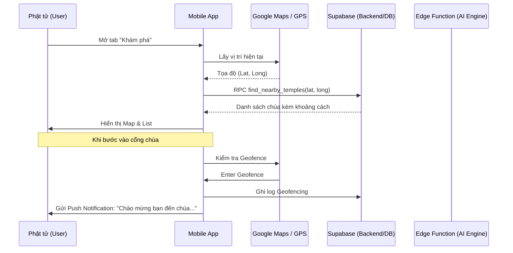
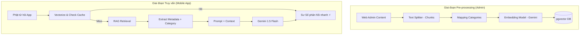

# Quy trình Hệ thống & Logic AI RAG

Tài liệu này chi tiết hóa cách thức hoạt động của các tính năng "High-tech" trong Đồ án tốt nghiệp.

---

## 1. Quy trình Người dùng (User Journey Workflow)

---

## 2. Quy trình AI Dharma Bot (RAG Pipeline)

Đây là tính năng "Ghi điểm" cực lớn, biến App thành một người thầy số.

### 2.1 Quy trình xử lý (Logic Flow)
Hệ thống áp dụng kiến trúc **Semantic Caching** để tối ưu hiệu năng:
- **B1. Embedding:** Câu hỏi được chuyển thành Vector 768 chiều.
- **B2. Semantic Cache Check:** Quét bảng `ai_query_cache` (ngưỡng 0.95). 
    - Nếu khớp (Hit): Phản hồi tức thì.
    - Nếu không (Miss): Thực hiện RAG.
- **B3. RAG Retrieval:** Tìm dẫn chứng tương đồng nhất từ kho kinh sách.
- **B4. Enrichment:** Bổ sung thông tin về Chuyên đề (Ví dụ: Kinh Tạng, Luận Tạng...) để tăng độ tin cậy. 
- **B5. LLM Generation:** Gemini 3 Flash đóng vai "Sư Số" để tổng hợp câu trả lời từ dẫn chứng.
- **B6. Persistence:** Lưu kết quả vào Cache kèm Citation thông tin chuyên đề.

### 2.2 Cơ chế Cache Invalidation
- **Tính chính xác:** Khi Admin cập nhật tài liệu nguồn, hệ thống tự động xóa bộ nhớ đệm (Invalidation) để đảm bảo không trả lời sai kiến thức cũ.

---

## 3. Đặc tả Nhân vật AI: Sư Số (Monastic Persona)

Hệ thống RAG không chỉ trả về thông tin khô khan mà được nhân hóa thành vị **"Sư Số"**:
- **Xưng hô:** Sư xưng là "Sư", gọi người dùng là "con" hoặc "đạo hữu".
- **Văn phong:** Từ thốn, sáng suốt, sử dụng thuật ngữ Phật giáo Nam tông (Ví dụ: Chánh Biến Tri, Bát Chánh Đạo, Ruộng phước...).
- **Nguyên tắc trả lời:** Tuyệt đối trung thành với tài liệu dẫn chứng, không bịa đặt (Hallucination protection).

---

## 3. Logic Geofencing & Push Notification

- **Mobile side:** Sử dụng thư viện `flutter_geofencing` hoặc `geolocator`.
- **Server side:** 
    - Khi nhận sự kiện "Enter", truy vấn `site_settings` của `tenant_id` tương ứng để lấy lời chào đã cấu trúc sẵn.
    - Gửi qua Firebase Cloud Messaging (FCM).

---

## 4. Tính năng AR (Số hóa di sản)

- **Input:** Camera Frame.
- **Processing:** Image Tracking (nhận diện phù điêu/tượng).
- **Output:** Overlay 3D hoặc Text/Audio thuyết minh.
- **Giá trị:** Nâng tầm trải nghiệm tham quan thực tế tại chùa, biến mỗi ngôi chùa thành một "Bảo tàng số".
