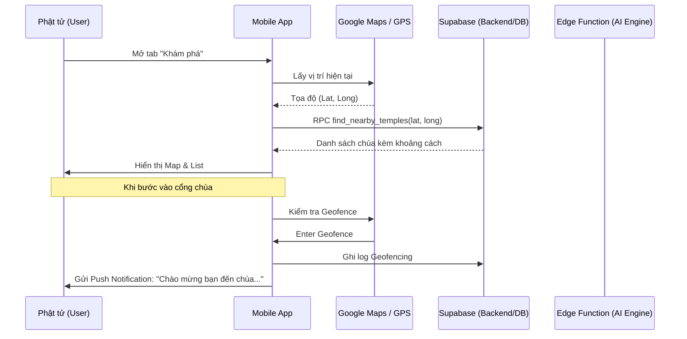
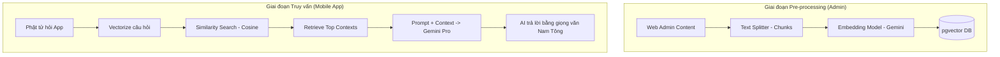

# Quy trình Hệ thống & Logic AI RAG

Tài liệu này chi tiết hóa cách thức hoạt động của các tính năng "High-tech" trong Đồ án tốt nghiệp.

---

## 1. Quy trình Người dùng (User Journey Workflow)

---

## 2. Quy trình AI Dharma Bot (RAG Pipeline)

Đây là tính năng "Ghi điểm" cực lớn, biến App thành một người thầy số.

---

## 3. Logic Geofencing & Push Notification

- **Mobile side:** Sử dụng thư viện `flutter_geofencing` hoặc `geolocator`.
- **Server side:** 
    - Khi nhận sự kiện "Enter", truy vấn `site_settings` của `tenant_id` tương ứng để lấy lời chào đã cấu trúc sẵn.
    - Gửi qua Firebase Cloud Messaging (FCM).

---

## 4. Tính năng AR (Số hóa di sản)

- **Input:** Camera Frame.
- **Processing:** Image Tracking (nhận diện phù điêu/tượng).
- **Output:** Overlay 3D hoặc Text/Audio thuyết minh.
- **Giá trị:** Nâng tầm trải nghiệm tham quan thực tế tại chùa, biến mỗi ngôi chùa thành một "Bảo tàng số".
