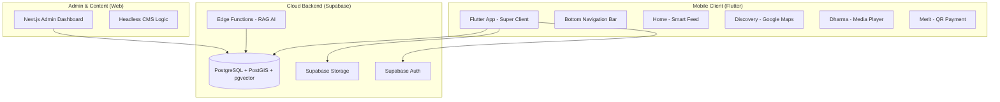
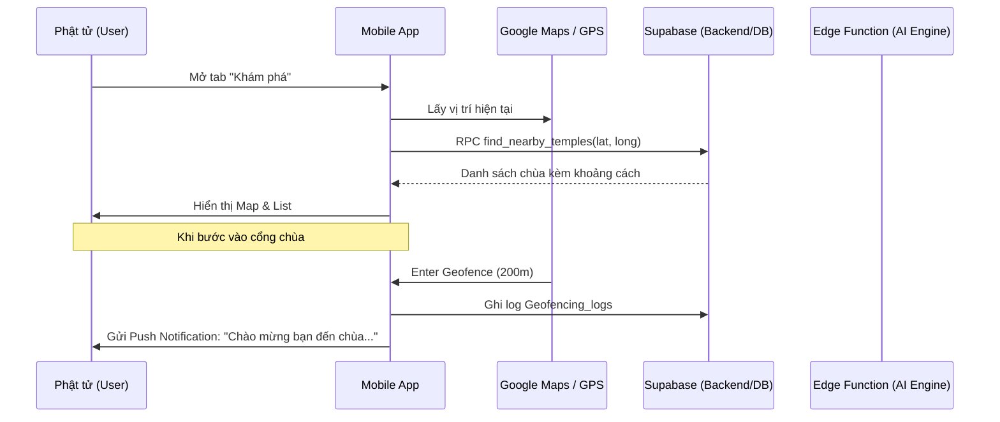
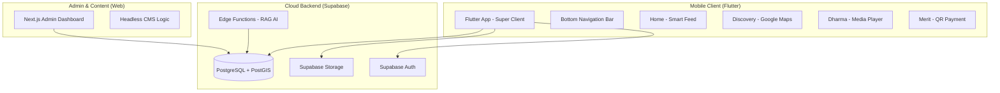
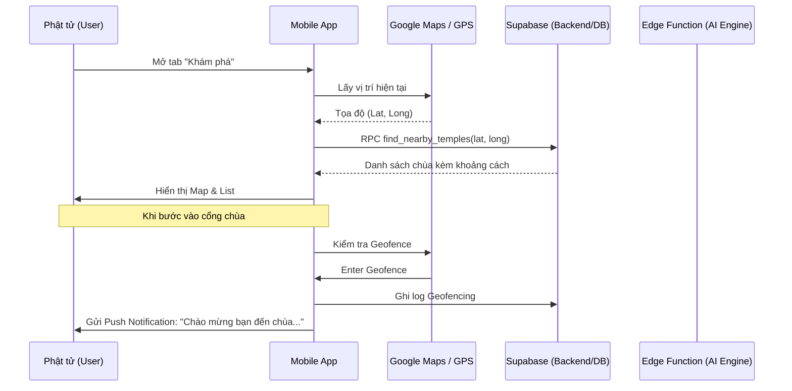
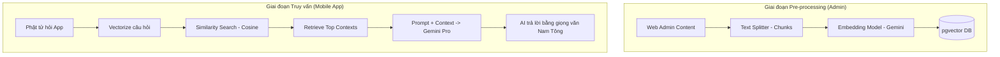

# HỆ SINH THÁI DI ĐỘNG ĐA CHÙA KHMER: BẢN QUY HOẠCH CHI TIẾT NHẤT (VERBATIM MASTER PLAN)

Tài liệu này là bản hợp nhất nguyên văn (y chang) từ các tệp hồ sơ 13, 14, 15, 16 và 17. Đây là nguồn dữ liệu đầy đủ và chi tiết nhất cho toàn bộ dự án.

---

# [PHẦN 13] CHIẾN LƯỢC HỆ SINH THÁI PHẬT GIÁO ĐA NỀN TẢNG (MASTER BLUEPRINT)

# Chiến lược Hệ sinh thái Phật giáo Đa nền tảng (Master Blueprint)

Tài liệu này là bản quy hoạch tổng thể cấp cao nhất, kết hợp giữa Web Admin (Next.js) và Mobile App (Flutter) tích hợp công nghệ AI và GIS. Đây là tài liệu gốc để triển khai kỹ thuật và bảo vệ **Đồ án Tốt nghiệp (ĐATN)** mức độ Xuất sắc.

---

## 1. Kiến trúc Hệ thống Tổng thể (Comprehensive Architecture)

Kiến trúc được xây dựng theo mô hình **Headless CMS & Multi-tenant Super Client**, sử dụng Supabase làm trái tim dữ liệu (Single Source of Truth).



---

## 2. Chi tiết Phân hệ & Tính năng Cốt lõi

### **A. Khám phá & GIS (Discovery System)**
Sử dụng công nghệ **PostGIS** để xử lý không gian thực tế:
- **Tìm chùa gần nhất:** Sử dụng Index GIST để truy vấn khoảng cách cực nhanh (O(1)).
- **Geofencing & Automation:** 
    - Khi nhận diện User trong bán kính 200m của chùa, thiết bị kích hoạt `Push Notification`.
    - Tự động hiển thị `Sơ đồ kiến trúc` và `Lịch hành lễ` của chùa đó ngay lập tức.

### **B. Người thầy số (AI Dharma Bot - RAG Logic)**
Đây là tính năng đột phá sử dụng **Retrieval-Augmented Generation (RAG)**:
1. **Pre-processing:** Toàn bộ nội dung Pháp thoại (Text/Audio) được cắt nhỏ (Chunks) -> Vectorize (Embedding) -> Lưu vào `pgvector`.
2. **Querying:** Khi Phật tử hỏi, hệ thống tìm kiếm nội dung tương đồng cơ sở nhất (Cosine Similarity) -> Truyền ngữ cảnh cho AI (Gemini) -> Trả lời chính xác theo quan điểm Phật giáo Nam Tông.

### **C. Phước điền & Minh bạch (Merit Gateway)**
- **VietQR Động:** Mã QR tự động chứa `Mã định danh dự án` và `Tenant ID`.
- **Sổ cái Minh bạch (Public Ledger):** Hiển thị thời gian thực các đóng góp đã được Admin duyệt trên Web, tăng niềm tin cho Phật tử.

---

## 3. Thiết kế Kỹ thuật Chuyên sâu (Technical Deep-Dive)

### **1. Quy trình User Journey (Sequence Diagram)**



### **2. Đề xuất Migration Database (Mobile & AI Ready)**

```sql
-- 1. Kích hoạt PostGIS & Vector
CREATE EXTENSION IF NOT EXISTS postgis;
CREATE EXTENSION IF NOT EXISTS vector;

-- 2. Nâng cấp bảng Tenants (Địa lý)
ALTER TABLE tenants ADD COLUMN geog GEOGRAPHY(POINT);
CREATE INDEX idx_tenants_geog ON tenants USING GIST (geog);

-- 3. Bảng Embedding hỗ trợ AI Bot
CREATE TABLE dharma_embeddings (
  id UUID PRIMARY KEY DEFAULT uuid_generate_v4(),
  tenant_id UUID REFERENCES tenants(id),
  content_text TEXT,
  embedding vector(1536), -- Phù hợp với Gemini/OpenAI
  metadata JSONB
);
```

---

## 4. Đề cương Đồ án Tốt nghiệp (Graduation Thesis Proposal)

**Tên đề tài:** Hệ sinh thái Quản lý và Phát triển Văn hóa Chùa Khmer Đa nền tảng (Web & Mobile) tích hợp AI (RAG) và GIS.

**Tính cấp thiết:**
- Hiện đại hóa việc lưu giữ văn hóa Khmer trong kỷ nguyên số.
- Giải quyết bài toán minh bạch tài chính trong phước điền.
- Ứng dụng công nghệ mới nhất (AI/GIS) vào đời sống tâm linh.

**Cấu trúc Đồ án:**
- **Chương 1:** Tổng quan về văn hóa Khmer và nhu cầu chuyển đổi số.
- **Chương 2:** Cơ sở lý thuyết (Multi-tenancy, Headless Architecture, RAG, PostGIS).
- **Chương 3:** Phân tích, thiết kế hệ thống và cấu trúc dữ liệu.
- **Chương 4:** Thực nghiệm triển khai (Web Admin & Flutter App).
- **Chương 5:** Đánh giá hiệu năng và hướng phát triển (AR/Metaverse).

---

## 5. Lộ trình Triển khai (Roadmap)

1. **Tuần 1-2:** Hoàn thiện Web Core, chuẩn hóa Schema đa thuê bao (Multi-tenant) - **[DONE]**.
2. **Tuần 3-4:** Khởi tạo Flutter Project, tích hợp Google Maps & PostGIS Query.
3. **Tuần 5-6:** Phát triển AI RAG Pipeline & Thư viện Pháp thoại.
4. **Tuần 7-8:** Tích hợp VietQR, kiểm thử toàn diện và đóng gói báo cáo.

---

## 6. Ngôn ngữ UX/UI: "Premium Zen"
- **Triết lý:** "Thanh tịnh - Hiện đại - Chân thực".
- **Visuals:** Sử dụng hiệu ứng mờ chồng lớp (Glassmorphism), màu sắc Saffron (Vàng nghệ), Brown (Cánh dán) và Bone White.
- **Micro-interactions:** Hiệu ứng chuyển động hữu cơ, tạo cảm giác thư thái khi sử dụng.

---
*Tài liệu này được kế thừa và tổng hợp toàn bộ tri thức từ các tệp thiết kế chi tiết (Files 14-17).*
*Cập nhật lần cuối: 16/03/2026 bởi Antigravity AI*

---

# [PHẦN 14] KẾ HOẠCH CHI TIẾT: HỆ SINH THÁI ỨNG DỤNG DI ĐỘNG (ARCH DETAIL)

# Kế hoạch chi tiết: Hệ sinh thái Ứng dụng Di động (Mobile App Ecosystem)

Dự án này mở rộng nền tảng Web hiện tại thành một hệ sinh thái đa kênh (Cross-platform), lấy dữ liệu từ Supabase làm hướng tâm (Single Source of Truth).

---

## 1. Kiến trúc Hệ thống (System Architecture)



---

## 2. Thiết kế Cơ sở Dữ liệu (Database Schema Extensions)

Để hỗ trợ tính năng **Khám phá (Discovery)** và **Địa lý (Geofencing)**, cần mở rộng bảng `tenants`:

| Trường (Field) | Kiểu dữ liệu | Mô tả |
| :--- | :--- | :--- |
| `latitude` | `FLOAT8` | Vĩ độ thực tế của chùa |
| `longitude` | `FLOAT8` | Kinh độ thực tế của chùa |
| `geog` | `GEOGRAPHY(POINT)` | Kiểu dữ liệu PostGIS để truy vấn bán kính nhanh |
| `address_vi` | `TEXT` | Địa chỉ chi tiết |
| `province_id` | `UUID` | Liên kết đến bảng tỉnh thành để lọc |

---

## 3. Chi tiết các Phân hệ chức năng

### **A. Khám phá (Discovery - Map & GPS)**
- **Công nghệ:** Google Maps SDK for Flutter + PostGIS.
- **Tính năng ĐATN:** 
    - Truy vấn SQL "Chùa gần tôi" sử dụng toán tử `<->` trong PostGIS để đạt hiệu năng O(1) với Index GIST.
    - **Geofencing:** Khi `current_location` nằm trong bán kính 200m của `geog`, gửi thông báo chào mừng qua FCM.

### **B. Pháp âm (Dharma - Audio Library)**
- **Công nghệ:** `just_audio` + `audio_service` (chạy nền).
- **Tính năng ĐATN:** 
    - **Offline Sync:** Sử dụng `Isar` hoặc `Hive` để lưu metadata kinh sách.
    - Đồng bộ bài giảng từ `dharma_talks` trên Web Admin.

### **C. Phước điền (Merit - Transparency)**
- **Tính năng ĐATN:**
    - Tích hợp **VietQR** động: Tự động truyền số tiền và nội dung (Mã dự án) vào QR.
    - **Sổ cái minh bạch:** Hiển thị Real-time danh sách đóng góp đã duyệt tự động từ Web.

---

## 4. Tính năng "Ghi điểm" (Advanced Features)

### **1. AI Dharma Bot (RAG)**
- **Quy trình:** 
    1. Vectorize dữ liệu từ `about_sections` và `dharma_talks` (dùng pgvector).
    2. Mobile gửi câu hỏi của Phật tử lên Supabase Edge Function.
    3. AI (Gemini/OpenAI) truy xuất ngữ cảnh và trả lời theo phong cách Nam Tông.

### **2. Augmented Reality (AR) Gateway**
- Sử dụng `ARCore`/`ARKit` cơ bản.
- **Kịch bản:** Quét hình ảnh tượng Phật tại chùa để hiện lên thông tin lịch sử và bài tụng liên quan.

---

## 5. Lộ trình Triển khai (Roadmap)

1.  **Tuần 1-2:** Khởi tạo Flutter Project, cấu trúc Multi-tenant (Super Client), tích hợp Auth chung.
2.  **Tuần 3:** Xây dựng Map & PostGIS Query, hoàn thiện tính năng "Chùa gần tôi".
3.  **Tuần 4:** Tích hợp Audio Player và Thư viện Pháp bảo.
4.  **Tuần 5:** Triển khai AI Bot và Geofencing.
5.  **Tuần 6:** Kiểm thử, đóng gói (Android/iOS) và viết báo cáo ĐATN.

---

# [PHẦN 15] ĐỀ XUẤT MIGRATION: MỞ RỘNG TÍNH NĂNG MOBILE & AI (SQL DEEP-DIVE)

# Đề xuất Migration: Mở rộng tính năng Mobile & AI

Dưới đây là mã SQL dự kiến để nâng cấp hệ thống hiện tại, sẵn sàng cho việc tích hợp Mobile App và AI Dharma Bot.

---

## 1. Kích hoạt PostGIS và Vector Search
```sql
-- Kích hoạt tiện ích địa lý và vector (Hỗ trợ AI)
CREATE EXTENSION IF NOT EXISTS postgis;
CREATE EXTENSION IF NOT EXISTS vector; -- Yêu cầu Supabase có hỗ trợ pgvector
```

---

## 2. Nâng cấp bảng Tenants (Tọa độ chùa)
```sql
-- Bổ sung thông tin địa lý vào bảng tenants
ALTER TABLE tenants 
ADD COLUMN latitude FLOAT8,
ADD COLUMN longitude FLOAT8,
ADD COLUMN address_vi TEXT,
ADD COLUMN geog GEOGRAPHY(POINT);

-- Index GIST để tìm kiếm "Chùa gần đây" với tốc độ cực nhanh
CREATE INDEX idx_tenants_geog ON tenants USING GIST (geog);

-- Trigger tự động cập nhật geog khi nhập latitude/longitude
CREATE OR REPLACE FUNCTION update_tenants_geog()
RETURNS TRIGGER AS $$
BEGIN
  IF NEW.latitude IS NOT NULL AND NEW.longitude IS NOT NULL THEN
    NEW.geog := ST_SetSRID(ST_MakePoint(NEW.longitude, NEW.latitude), 4324)::geography;
  END IF;
  RETURN NEW;
END;
$$ LANGUAGE plpgsql;

CREATE TRIGGER tr_update_tenants_geog
BEFORE INSERT OR UPDATE ON tenants
FOR EACH ROW EXECUTE FUNCTION update_tenants_geog();
```

---

## 3. Bảng Embedding hỗ trợ AI Dharma Bot (RAG)
```sql
-- Lưu trữ các vector đặc trưng của nội dung để AI tìm kiếm
CREATE TABLE dharma_embeddings (
  id UUID PRIMARY KEY DEFAULT uuid_generate_v4(),
  tenant_id UUID REFERENCES tenants(id) ON DELETE CASCADE,
  content_id UUID, -- Link tới pages.id hoặc dharma_talks.id
  content_type TEXT, -- 'page', 'talk', 'news'
  content_text TEXT, -- Đoạn text được cắt nhỏ (Chunks)
  embedding vector(1536), -- 1536 là số chiều của OpenAI/Gemini embedding
  metadata JSONB
);

CREATE INDEX idx_dharma_embeddings_vector ON dharma_embeddings 
USING ivfflat (embedding vector_cosine_ops)
WITH (lists = 100);
```

---

## 4. Bảng Geofencing Log (Vận hành tự động)
```sql
-- Lưu vết khi người dùng bước vào khu vực chùa để phân tích hành vi
CREATE TABLE geofencing_logs (
  id UUID PRIMARY KEY DEFAULT uuid_generate_v4(),
  user_id UUID REFERENCES auth.users(id),
  tenant_id UUID REFERENCES tenants(id),
  action_type TEXT, -- 'enter', 'exit'
  occurred_at TIMESTAMP WITH TIME ZONE DEFAULT NOW()
);
```

---

# [PHẦN 16] QUY TRÌNH HỆ THỐNG & LOGIC AI RAG (SEQUENCES & FLOWS)

# Quy trình Hệ thống & Logic AI RAG

Tài liệu này chi tiết hóa cách thức hoạt động của các tính năng "High-tech" trong Đồ án tốt nghiệp.

---

## 1. Quy trình Người dùng (User Journey Workflow)



---

## 2. Quy trình AI Dharma Bot (RAG Pipeline)

Đây là tính năng "Ghi điểm" cực lớn, biến App thành một người thầy số.



---

## 3. Logic Geofencing & Push Notification

- **Mobile side:** Sử dụng thư viện `flutter_geofencing` hoặc `geolocator`.
- **Server side:** 
    - Khi nhận sự kiện "Enter", truy vấn `site_settings` của `tenant_id` tương ứng để lấy lời chào đã cấu trúc sẵn.
    - Gửi qua Firebase Cloud Messaging (FCM).

---

## 4. Tính năng AR (Số hóa di sản)

- **Input:** Camera Frame.
- **Processing:** Image Tracking (nhận diện phù điêu/tượng).
- **Output:** Overlay 3D hoặc Text/Audio thuyết minh.
- **Giá trị:** Nâng tầm trải nghiệm tham quan thực tế tại chùa, biến mỗi ngôi chùa thành một "Bảo tàng số".

---

# [PHẦN 17] ĐỀ CƯƠNG ĐỒ ÁN TỐT NGHIỆP (FULL ACADEMIC PROPOSAL)

# Đề cương Đồ án Tốt nghiệp (Proposal for Graduation Thesis)

**Tên đề tài:** Hệ sinh thái Quản lý và Phát triển Văn hóa Chùa Khmer Đa nền tảng (Web & Mobile) tích hợp công nghệ AI (RAG) và GIS (PostGIS).

---

## 1. Tính cấp thiết của đề tài
- **Bảo tồn văn hóa:** Số hóa di sản chùa Khmer, giúp thế hệ trẻ tiếp cận dễ dàng qua di động.
- **Hiện đại hóa quản lý:** Chuyển đổi từ quản lý truyền thống sang hệ thống đa chùa (Multi-tenant) tập trung.
- **Tiên phong công nghệ:** Ứng dụng AI để giải đáp giáo lý và GIS để kết nối địa lý tâm linh.

---

## 2. Đối tượng & Phạm vi nghiên cứu
- **Đối tượng:** Các ngôi chùa Khmer Nam Bộ (Hệ thống chùa và các chi nhánh).
- **Phạm vi kỹ thuật:**
    - **Web Admin (CMS):** Next.js 15, Tailwind, Supabase.
    - **Mobile App:** Flutter (iOS/Android).
    - **AI/Data:** pgvector, RAG Pipeline, PostGIS.

---

## 3. Các tính năng cốt lõi (Core Features)
1. **Quản trị đa chùa (Multi-tenant):** Một hệ thống duy nhất phục vụ hàng trăm ngôi chùa với bản sắc riêng (theme, nội dung).
2. **Bản đồ Di sản (GIS Discovery):** Tìm kiếm chùa theo vị trí địa lý, tính toán khoảng cách thực tế, điều hướng GPS.
3. **Người thầy số (AI Dharma Bot):** Chatbot thông minh trả lời giáo lý dựa trên kho tàng Pháp thoại của hệ thống.
4. **Cổng công đức minh bạch (Merit Gateway):** Tích hợp VietQR động, công khai sổ cái đóng góp thời gian thực.
5. **Vận hành tự động (Geofencing):** Tự động nhận diện và gửi thông báo khi Phật tử đến chùa.

---

## 4. Kiến trúc kỹ thuật đề xuất
- **Frontend:** Next.js (Web) + Flutter (Mobile).
- **Backend-as-a-Service:** Supabase (PostgreSQL, Auth, Storage, Edge Functions).
- **Integration:** 
    - **FCM** cho thông báo.
    - **Google Maps API** cho bản đồ.
    - **Gemini API** cho trí tuệ nhân tạo.

---

## 5. Kết luận dự kiến
Đồ án không chỉ là một sản phẩm kỹ thuật mà còn là giải pháp xã hội bền vững, giúp kết nối cộng đồng Phật giáo Khmer trong kỷ nguyên số, đảm bảo tính minh bạch, tiện lợi và giáo dục sâu sắc.

---
*Tổng hợp Verbatim bởi Antigravity AI - 16/03/2026*
