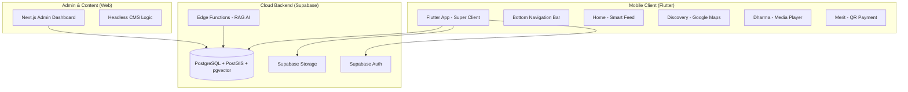
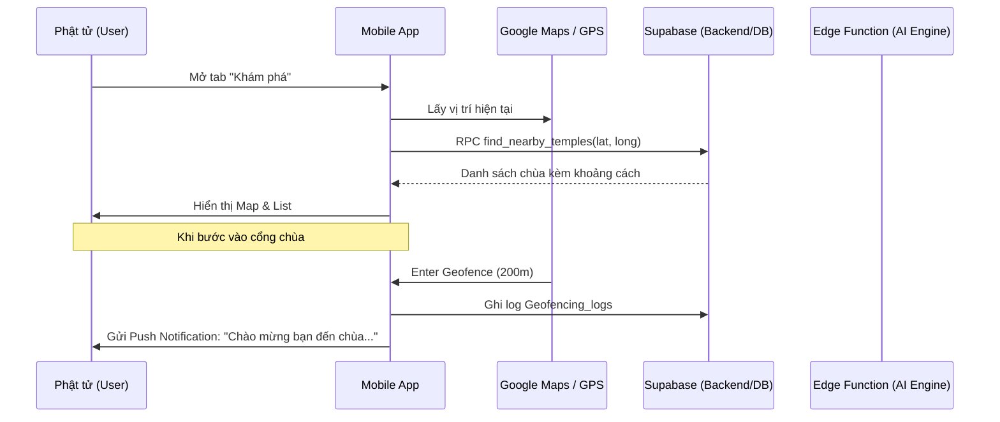
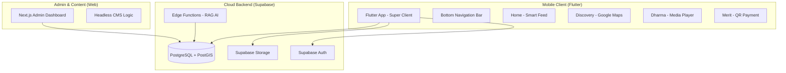
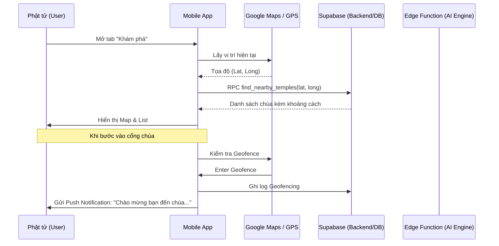
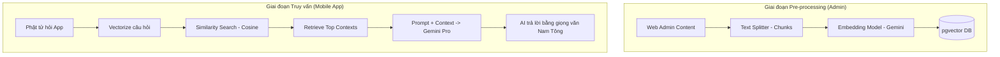
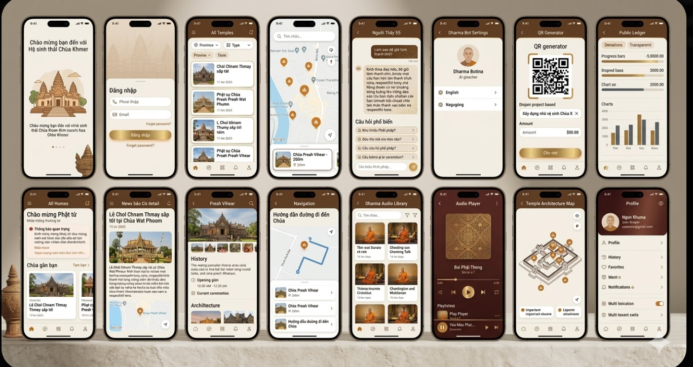

# HỆ SINH THÁI DI ĐỘNG ĐA CHÙA KHMER: BẢN QUY HOẠCH CHI TIẾT NHẤT (VERBATIM MASTER PLAN)

Tài liệu này là bản hợp nhất nguyên văn (y chang) từ các tệp hồ sơ 13, 14, 15, 16 và 17. Đây là nguồn dữ liệu đầy đủ và chi tiết nhất cho toàn bộ dự án.

---

# [PHẦN 13] CHIẾN LƯỢC HỆ SINH THÁI PHẬT GIÁO ĐA NỀN TẢNG (MASTER BLUEPRINT)

# Chiến lược Hệ sinh thái Phật giáo Đa nền tảng (Master Blueprint)

Tài liệu này là bản quy hoạch tổng thể cấp cao nhất, kết hợp giữa Web Admin (Next.js) và Mobile App (Flutter) tích hợp công nghệ AI và GIS. Đây là tài liệu gốc để triển khai kỹ thuật và bảo vệ **Đồ án Tốt nghiệp (ĐATN)** mức độ Xuất sắc.

---

## 1. Kiến trúc Hệ thống Tổng thể (Comprehensive Architecture)

Kiến trúc được xây dựng theo mô hình **Headless CMS & Multi-tenant Super Client**, sử dụng Supabase làm trái tim dữ liệu (Single Source of Truth).



---

## 2. Chi tiết Phân hệ & Tính năng Cốt lõi

### **A. Khám phá & GIS (Discovery System)**
Sử dụng công nghệ **PostGIS** để xử lý không gian thực tế:
- **Tìm chùa gần nhất:** Sử dụng Index GIST để truy vấn khoảng cách cực nhanh (O(1)).
- **Geofencing & Automation:** 
    - Khi nhận diện User trong bán kính 200m của chùa, thiết bị kích hoạt `Push Notification`.
    - Tự động hiển thị `Sơ đồ kiến trúc` và `Lịch hành lễ` của chùa đó ngay lập tức.

### **B. Người thầy số (AI Dharma Bot - RAG Logic)**
Đây là tính năng đột phá sử dụng **Retrieval-Augmented Generation (RAG)**:
1. **Pre-processing:** Toàn bộ nội dung Pháp thoại (Text/Audio) được cắt nhỏ (Chunks) -> Vectorize (Embedding) -> Lưu vào `pgvector`.
2. **Querying:** Khi Phật tử hỏi, hệ thống tìm kiếm nội dung tương đồng cơ sở nhất (Cosine Similarity) -> Truyền ngữ cảnh cho AI (Gemini) -> Trả lời chính xác theo quan điểm Phật giáo Nam Tông.

### **C. Phước điền & Minh bạch (Merit Gateway)**
- **VietQR Động:** Mã QR tự động chứa `Mã định danh dự án` và `Tenant ID`.
- **Sổ cái Minh bạch (Public Ledger):** Hiển thị thời gian thực các đóng góp đã được Admin duyệt trên Web, tăng niềm tin cho Phật tử.

---

## 3. Thiết kế Kỹ thuật Chuyên sâu (Technical Deep-Dive)

### **1. Quy trình User Journey (Sequence Diagram)**



### **2. Đề xuất Migration Database (Mobile & AI Ready)**

```sql
-- 1. Kích hoạt PostGIS & Vector
CREATE EXTENSION IF NOT EXISTS postgis;
CREATE EXTENSION IF NOT EXISTS vector;

-- 2. Nâng cấp bảng Tenants (Địa lý)
ALTER TABLE tenants ADD COLUMN geog GEOGRAPHY(POINT);
CREATE INDEX idx_tenants_geog ON tenants USING GIST (geog);

-- 3. Bảng Embedding hỗ trợ AI Bot
CREATE TABLE dharma_embeddings (
  id UUID PRIMARY KEY DEFAULT uuid_generate_v4(),
  tenant_id UUID REFERENCES tenants(id),
  content_text TEXT,
  embedding vector(1536), -- Phù hợp với Gemini/OpenAI
  metadata JSONB
);
```

---

## 4. Đề cương Đồ án Tốt nghiệp (Graduation Thesis Proposal)

**Tên đề tài:** Hệ sinh thái Quản lý và Phát triển Văn hóa Chùa Khmer Đa nền tảng (Web & Mobile) tích hợp AI (RAG) và GIS.

**Tính cấp thiết:**
- Hiện đại hóa việc lưu giữ văn hóa Khmer trong kỷ nguyên số.
- Giải quyết bài toán minh bạch tài chính trong phước điền.
- Ứng dụng công nghệ mới nhất (AI/GIS) vào đời sống tâm linh.

**Cấu trúc Đồ án:**
- **Chương 1:** Tổng quan về văn hóa Khmer và nhu cầu chuyển đổi số.
- **Chương 2:** Cơ sở lý thuyết (Multi-tenancy, Headless Architecture, RAG, PostGIS).
- **Chương 3:** Phân tích, thiết kế hệ thống và cấu trúc dữ liệu.
- **Chương 4:** Thực nghiệm triển khai (Web Admin & Flutter App).
- **Chương 5:** Đánh giá hiệu năng và hướng phát triển (AR/Metaverse).

---

## 5. Lộ trình Triển khai (Roadmap)

1. **Tuần 1-2:** Hoàn thiện Web Core, chuẩn hóa Schema đa thuê bao (Multi-tenant) - **[DONE]**.
2. **Tuần 3-4:** Khởi tạo Flutter Project, tích hợp OpenStreetMap & PostGIS Query.
3. **Tuần 5-6:** Phát triển AI RAG Pipeline & Thư viện Pháp thoại.
4. **Tuần 7-8:** Tích hợp VietQR, kiểm thử toàn diện và đóng gói báo cáo.

---

## 6. Ngôn ngữ UX/UI: "Premium Zen"
- **Triết lý:** "Thanh tịnh - Hiện đại - Chân thực".
- **Visuals:** Sử dụng hiệu ứng mờ chồng lớp (Glassmorphism), màu sắc Saffron (Vàng nghệ), Brown (Cánh dán) và Bone White.
- **Micro-interactions:** Hiệu ứng chuyển động hữu cơ, tạo cảm giác thư thái khi sử dụng.

---
*Tài liệu này được kế thừa và tổng hợp toàn bộ tri thức từ các tệp thiết kế chi tiết (Files 14-17).*
*Cập nhật lần cuối: 16/03/2026 bởi Antigravity AI*

---

# [PHẦN 14] KẾ HOẠCH CHI TIẾT: HỆ SINH THÁI ỨNG DỤNG DI ĐỘNG (ARCH DETAIL)

# Kế hoạch chi tiết: Hệ sinh thái Ứng dụng Di động (Mobile App Ecosystem)

Dự án này mở rộng nền tảng Web hiện tại thành một hệ sinh thái đa kênh (Cross-platform), lấy dữ liệu từ Supabase làm hướng tâm (Single Source of Truth).

---

## 1. Kiến trúc Hệ thống (System Architecture)



---

## 2. Thiết kế Cơ sở Dữ liệu (Database Schema Extensions)

Để hỗ trợ tính năng **Khám phá (Discovery)** và **Địa lý (Geofencing)**, cần mở rộng bảng `tenants`:

| Trường (Field) | Kiểu dữ liệu | Mô tả |
| :--- | :--- | :--- |
| `latitude` | `FLOAT8` | Vĩ độ thực tế của chùa |
| `longitude` | `FLOAT8` | Kinh độ thực tế của chùa |
| `geog` | `GEOGRAPHY(POINT)` | Kiểu dữ liệu PostGIS để truy vấn bán kính nhanh |
| `address_vi` | `TEXT` | Địa chỉ chi tiết |
| `province_id` | `UUID` | Liên kết đến bảng tỉnh thành để lọc |

---

## 3. Chi tiết các Phân hệ chức năng

### **A. Khám phá (Discovery - Map & GPS)**
- **Công nghệ:** flutter_map (OpenStreetMap) + PostGIS.
- **Tính năng ĐATN:** 
    - Truy vấn SQL "Chùa gần tôi" sử dụng toán tử `<->` trong PostGIS để đạt hiệu năng O(1) với Index GIST.
    - **Geofencing:** Khi `current_location` nằm trong bán kính 200m của `geog`, gửi thông báo chào mừng qua FCM.

### **B. Pháp âm (Dharma - Audio Library)**
- **Công nghệ:** `just_audio` + `audio_service` (chạy nền).
- **Tính năng ĐATN:** 
    - **Offline Sync:** Sử dụng `Isar` hoặc `Hive` để lưu metadata kinh sách.
    - Đồng bộ bài giảng từ `dharma_talks` trên Web Admin.

### **C. Phước điền (Merit - Transparency)**
- **Tính năng ĐATN:**
    - Tích hợp **VietQR** động: Tự động truyền số tiền và nội dung (Mã dự án) vào QR.
    - **Sổ cái minh bạch:** Hiển thị Real-time danh sách đóng góp đã duyệt tự động từ Web.

---

## 4. Tính năng "Ghi điểm" (Advanced Features)

### **1. AI Dharma Bot (RAG)**
- **Quy trình:** 
    1. Vectorize dữ liệu từ `about_sections` và `dharma_talks` (dùng pgvector).
    2. Mobile gửi câu hỏi của Phật tử lên Supabase Edge Function.
    3. AI (Gemini/OpenAI) truy xuất ngữ cảnh và trả lời theo phong cách Nam Tông.

### **2. Augmented Reality (AR) Gateway**
- Sử dụng `ARCore`/`ARKit` cơ bản.
- **Kịch bản:** Quét hình ảnh tượng Phật tại chùa để hiện lên thông tin lịch sử và bài tụng liên quan.

---

## 5. Lộ trình Triển khai (Roadmap)

1.  **Tuần 1-2:** Khởi tạo Flutter Project, cấu trúc Multi-tenant (Super Client), tích hợp Auth chung.
2.  **Tuần 3:** Xây dựng Map & PostGIS Query, hoàn thiện tính năng "Chùa gần tôi".
3.  **Tuần 4:** Tích hợp Audio Player và Thư viện Pháp bảo.
4.  **Tuần 5:** Triển khai AI Bot và Geofencing.
5.  **Tuần 6:** Kiểm thử, đóng gói (Android/iOS) và viết báo cáo ĐATN.

---

# [PHẦN 15] ĐỀ XUẤT MIGRATION: MỞ RỘNG TÍNH NĂNG MOBILE & AI (SQL DEEP-DIVE)

# Đề xuất Migration: Mở rộng tính năng Mobile & AI

Dưới đây là mã SQL dự kiến để nâng cấp hệ thống hiện tại, sẵn sàng cho việc tích hợp Mobile App và AI Dharma Bot.

---

## 1. Kích hoạt PostGIS và Vector Search
```sql
-- Kích hoạt tiện ích địa lý và vector (Hỗ trợ AI)
CREATE EXTENSION IF NOT EXISTS postgis;
CREATE EXTENSION IF NOT EXISTS vector; -- Yêu cầu Supabase có hỗ trợ pgvector
```

---

## 2. Nâng cấp bảng Tenants (Tọa độ chùa)
```sql
-- Bổ sung thông tin địa lý vào bảng tenants
ALTER TABLE tenants 
ADD COLUMN latitude FLOAT8,
ADD COLUMN longitude FLOAT8,
ADD COLUMN address_vi TEXT,
ADD COLUMN geog GEOGRAPHY(POINT);

-- Index GIST để tìm kiếm "Chùa gần đây" với tốc độ cực nhanh
CREATE INDEX idx_tenants_geog ON tenants USING GIST (geog);

-- Trigger tự động cập nhật geog khi nhập latitude/longitude
CREATE OR REPLACE FUNCTION update_tenants_geog()
RETURNS TRIGGER AS $$
BEGIN
  IF NEW.latitude IS NOT NULL AND NEW.longitude IS NOT NULL THEN
    NEW.geog := ST_SetSRID(ST_MakePoint(NEW.longitude, NEW.latitude), 4324)::geography;
  END IF;
  RETURN NEW;
END;
$$ LANGUAGE plpgsql;

CREATE TRIGGER tr_update_tenants_geog
BEFORE INSERT OR UPDATE ON tenants
FOR EACH ROW EXECUTE FUNCTION update_tenants_geog();
```

---

## 3. Bảng Embedding hỗ trợ AI Dharma Bot (RAG)
```sql
-- Lưu trữ các vector đặc trưng của nội dung để AI tìm kiếm
CREATE TABLE dharma_embeddings (
  id UUID PRIMARY KEY DEFAULT uuid_generate_v4(),
  tenant_id UUID REFERENCES tenants(id) ON DELETE CASCADE,
  content_id UUID, -- Link tới pages.id hoặc dharma_talks.id
  content_type TEXT, -- 'page', 'talk', 'news'
  content_text TEXT, -- Đoạn text được cắt nhỏ (Chunks)
  embedding vector(1536), -- 1536 là số chiều của OpenAI/Gemini embedding
  metadata JSONB
);

CREATE INDEX idx_dharma_embeddings_vector ON dharma_embeddings 
USING ivfflat (embedding vector_cosine_ops)
WITH (lists = 100);
```

---

## 4. Bảng Geofencing Log (Vận hành tự động)
```sql
-- Lưu vết khi người dùng bước vào khu vực chùa để phân tích hành vi
CREATE TABLE geofencing_logs (
  id UUID PRIMARY KEY DEFAULT uuid_generate_v4(),
  user_id UUID REFERENCES auth.users(id),
  tenant_id UUID REFERENCES tenants(id),
  action_type TEXT, -- 'enter', 'exit'
  occurred_at TIMESTAMP WITH TIME ZONE DEFAULT NOW()
);
```

---

# [PHẦN 16] QUY TRÌNH HỆ THỐNG & LOGIC AI RAG (SEQUENCES & FLOWS)

# Quy trình Hệ thống & Logic AI RAG

Tài liệu này chi tiết hóa cách thức hoạt động của các tính năng "High-tech" trong Đồ án tốt nghiệp.

---

## 1. Quy trình Người dùng (User Journey Workflow)



---

## 2. Quy trình AI Dharma Bot (RAG Pipeline)

Đây là tính năng "Ghi điểm" cực lớn, biến App thành một người thầy số.



---

## 3. Logic Geofencing & Push Notification

- **Mobile side:** Sử dụng thư viện `flutter_geofencing` hoặc `geolocator`.
- **Server side:** 
    - Khi nhận sự kiện "Enter", truy vấn `site_settings` của `tenant_id` tương ứng để lấy lời chào đã cấu trúc sẵn.
    - Gửi qua Firebase Cloud Messaging (FCM).

---

## 4. Tính năng AR (Số hóa di sản)

- **Input:** Camera Frame.
- **Processing:** Image Tracking (nhận diện phù điêu/tượng).
- **Output:** Overlay 3D hoặc Text/Audio thuyết minh.
- **Giá trị:** Nâng tầm trải nghiệm tham quan thực tế tại chùa, biến mỗi ngôi chùa thành một "Bảo tàng số".

---

# [PHẦN 17] ĐỀ CƯƠNG ĐỒ ÁN TỐT NGHIỆP (FULL ACADEMIC PROPOSAL)

# Đề cương Đồ án Tốt nghiệp (Proposal for Graduation Thesis)

**Tên đề tài:** Hệ sinh thái Quản lý và Phát triển Văn hóa Chùa Khmer Đa nền tảng (Web & Mobile) tích hợp công nghệ AI (RAG) và GIS (PostGIS).

---

## 1. Tính cấp thiết của đề tài
- **Bảo tồn văn hóa:** Số hóa di sản chùa Khmer, giúp thế hệ trẻ tiếp cận dễ dàng qua di động.
- **Hiện đại hóa quản lý:** Chuyển đổi từ quản lý truyền thống sang hệ thống đa chùa (Multi-tenant) tập trung.
- **Tiên phong công nghệ:** Ứng dụng AI để giải đáp giáo lý và GIS để kết nối địa lý tâm linh.

---

## 2. Đối tượng & Phạm vi nghiên cứu
- **Đối tượng:** Các ngôi chùa Khmer Nam Bộ (Hệ thống chùa và các chi nhánh).
- **Phạm vi kỹ thuật:**
    - **Web Admin (CMS):** Next.js 15, Tailwind, Supabase.
    - **Mobile App:** Flutter (iOS/Android).
    - **AI/Data:** pgvector, RAG Pipeline, PostGIS.

---

## 3. Các tính năng cốt lõi (Core Features)
1. **Quản trị đa chùa (Multi-tenant):** Một hệ thống duy nhất phục vụ hàng trăm ngôi chùa với bản sắc riêng (theme, nội dung).
2. **Bản đồ Di sản (GIS Discovery):** Tìm kiếm chùa theo vị trí địa lý, tính toán khoảng cách thực tế, điều hướng GPS.
3. **Người thầy số (AI Dharma Bot):** Chatbot thông minh trả lời giáo lý dựa trên kho tàng Pháp thoại của hệ thống.
4. **Cổng công đức minh bạch (Merit Gateway):** Tích hợp VietQR động, công khai sổ cái đóng góp thời gian thực.
5. **Vận hành tự động (Geofencing):** Tự động nhận diện và gửi thông báo khi Phật tử đến chùa.

---

## 4. Kiến trúc kỹ thuật đề xuất
- **Frontend:** Next.js (Web) + Flutter (Mobile).
- **Backend-as-a-Service:** Supabase (PostgreSQL, Auth, Storage, Edge Functions).
- **Integration:** 
    - **FCM** cho thông báo.
    - **OpenStreetMap** cho bản đồ (Miễn phí).
    - **Gemini API** cho trí tuệ nhân tạo.

---

## 5. Kết luận dự kiến
Đồ án không chỉ là một sản phẩm kỹ thuật mà còn là giải pháp xã hội bền vững, giúp kết nối cộng đồng Phật giáo Khmer trong kỷ nguyên số, đảm bảo tính minh bạch, tiện lợi và giáo dục sâu sắc.

---
*Tổng hợp Verbatim bởi Antigravity AI - 16/03/2026*

---

# [PHẦN 18] ĐẶC TẢ MVP THỰC CHIẾN (APP CATEGORIES, FEATURES, FLOWS)

Phần này là bản chốt triển khai MVP dựa trên thảo luận thực tế, ưu tiên hoàn thành sản phẩm chạy ổn định end-to-end để demo và bảo vệ ĐATN.

## 1. Nguyên tắc cốt lõi của MVP

- Không gán chùa mặc định khi user vừa đăng nhập.
- App khởi động ở ngữ cảnh toàn hệ thống (`all_temples`) để tránh sai ngữ cảnh dữ liệu.
- Chỉ yêu cầu chọn chùa (`selected_temple`) khi chức năng bắt buộc cần `tenant_id` cụ thể (ví dụ: tạo VietQR công đức).
- Đề xuất chùa gần nhất chỉ là gợi ý (`nearby_suggestion`), không tự động khóa ngữ cảnh toàn app.

## 2. Danh mục chính trong ứng dụng (Bottom Navigation)

1. Trang chủ
2. Khám phá
3. Pháp âm
4. Công đức
5. Cá nhân

## 3. Chức năng MVP theo từng danh mục

### A. Trang chủ
- Hiển thị feed tổng hợp toàn hệ thống (tin mới, lịch lễ gần nhất).
- Khối gợi ý "Chùa gần bạn" dựa trên vị trí hiện tại.
- Nút nhanh: Khám phá, Hỏi AI, Công đức.

### B. Khám phá
- Bản đồ + danh sách chùa theo vị trí hiện tại.
- Tính khoảng cách và sắp xếp gần -> xa.
- Vào trang chi tiết chùa (địa chỉ, ảnh, giờ lễ, chỉ đường).
- Bộ lọc cơ bản theo tỉnh/thành.

### C. Pháp âm
- Danh sách bài pháp thoại.
- Trình phát audio cơ bản: phát/tạm dừng/tua.
- Tìm kiếm theo tiêu đề.
- Yêu thích bài nghe.

### D. Công đức
- Nhập số tiền và chọn hạng mục công đức.
- Sinh VietQR động theo chùa/hạng mục.
- Hiển thị sổ công đức minh bạch (bản ghi đã duyệt).
- Nếu chưa chọn chùa: bắt buộc mở modal chọn chùa trước khi tạo QR.

### E. Cá nhân
- Hồ sơ người dùng.
- Lịch sử hoạt động cơ bản (câu hỏi AI, công đức, bài nghe).
- Quản lý thông báo.
- Chuyển ngữ cảnh chùa theo chủ động người dùng.

## 4. Mô hình ngữ cảnh dữ liệu toàn app (Temple Context State)

### Các trạng thái
- `all_temples`: Mặc định sau login và khi mở app.
- `selected_temple`: User tự chọn một chùa cụ thể.
- `nearby_suggestion`: Chùa được gợi ý từ GPS để thao tác nhanh.

### Quy tắc chuyển trạng thái
- `all_temples -> selected_temple`: User chọn thủ công từ modal/danh sách.
- `all_temples -> nearby_suggestion`: App gợi ý theo GPS, chờ user xác nhận.
- `nearby_suggestion -> selected_temple`: User bấm "Dùng chùa này".
- `selected_temple -> all_temples`: User chọn "Xem toàn hệ thống".

## 5. Luồng hoạt động xử lý MVP (System Flows)

### Flow 1: Khởi động ứng dụng
1. App kiểm tra phiên đăng nhập.
2. Nếu chưa đăng nhập -> màn hình Auth.
3. Nếu đã đăng nhập -> vào `all_temples`.
4. Tải dữ liệu nền: cấu hình hệ thống, feed trang chủ, danh sách chùa cơ bản.
5. Nếu có quyền vị trí -> lấy chùa gần nhất để gợi ý, không auto khóa chùa.

### Flow 2: Khám phá chùa gần tôi
1. User mở tab Khám phá.
2. App xin quyền vị trí (nếu chưa có).
3. App gọi RPC PostGIS tìm chùa gần nhất.
4. Backend trả danh sách chùa + khoảng cách.
5. App hiển thị map marker + danh sách + bộ lọc.

### Flow 3: AI Dharma Bot (RAG)
1. User nhập câu hỏi.
2. App gửi `query` + `context_mode` (`all_temples` hoặc `selected_temple`) lên Edge Function.
3. Edge Function tạo embedding cho query.
4. Thực hiện similarity search trong `dharma_embeddings` theo ngữ cảnh.
5. Ghép prompt + context và gọi model AI.
6. Trả kết quả cho app kèm trích nguồn ngắn.

### Flow 4: Công đức bằng VietQR
1. User mở tab Công đức và nhập số tiền.
2. Nếu chưa có `selected_temple` -> hiển thị modal chọn chùa.
3. App sinh VietQR động theo `tenant_id` + hạng mục.
4. User thanh toán qua ngân hàng.
5. Bản ghi được duyệt sẽ hiển thị vào sổ minh bạch.

## 6. Rule bắt buộc để tránh lỗi ngữ cảnh

- Không auto set `selected_temple` sau login.
- Mọi API bắt buộc tenant phải kiểm tra điều kiện trước khi gọi.
- Màn hình luôn hiển thị nhãn ngữ cảnh hiện tại: "Toàn hệ thống" hoặc "Chùa X".
- Với dữ liệu AI: mặc định hỏi toàn hệ thống; cho phép người dùng bật bộ lọc theo chùa khi cần.

## 7. Phạm vi MVP và ngoài MVP

### Trong MVP (bắt buộc)
- Auth chạy ổn định.
- Discovery bằng PostGIS (map + list + khoảng cách).
- AI RAG bản cơ bản có ngữ cảnh và trả lời dùng được.
- VietQR + sổ công đức minh bạch bản cơ bản.

### Ngoài MVP (phase sau)
- AR/nhận diện hình ảnh nâng cao.
- Geofencing nền phức tạp đa nền tảng.
- Offline audio dung lượng lớn và đồng bộ sâu.

## 8. Tiêu chí nghiệm thu MVP

1. User đăng nhập và dùng trọn luồng từ khám phá -> AI -> công đức trong một phiên.
2. Không có lỗi sai tenant do gán mặc định.
3. Truy vấn chùa gần hoạt động với dữ liệu thật.
4. AI trả lời có trích ngữ cảnh.
5. Sổ minh bạch hiển thị đúng dữ liệu đã duyệt.

---
*Phần 18 được bổ sung để chuẩn hóa triển khai MVP thực tế - 16/03/2026*

---

# [PHẦN 19] PROMPT CHUẨN TRIỂN KHAI MOBILE APP MVP (FULL FLOW + UI STYLE)

Sao chép nguyên khối Prompt dưới đây để dùng cho AI hỗ trợ thiết kế kiến trúc, UI/UX, và đặc tả triển khai chi tiết.

## Prompt Chuẩn

Bạn là Solution Architect + Product Designer + Senior Flutter Engineer.

Nhiệm vụ: Thiết kế và đặc tả chi tiết một ứng dụng di động đa chùa Khmer (Flutter iOS/Android) theo mô hình Multi-tenant Super Client, dùng Supabase làm backend trung tâm, tích hợp GIS (PostGIS), AI RAG (pgvector + Edge Function), và cổng công đức minh bạch (VietQR).

Hãy trả về một bản đặc tả triển khai có thể đưa thẳng cho team dev, theo đúng các yêu cầu sau.

### 1) Bối cảnh và nguyên tắc bắt buộc

- Kiến trúc tổng thể: Web Admin (Next.js) đã có sẵn, Mobile chỉ mở rộng client.
- Backend: Supabase (PostgreSQL, Auth, Storage, Edge Functions), có PostGIS + pgvector.
- Không được gán chùa mặc định sau login.
- App phải chạy theo ngữ cảnh động:
    - all_temples (mặc định)
    - selected_temple (user tự chọn)
    - nearby_suggestion (gợi ý theo GPS)
- Chỉ ép chọn chùa ở chức năng bắt buộc cần tenant_id cụ thể (đặc biệt là VietQR công đức).
- Mục tiêu MVP: chạy ổn định end-to-end để demo bảo vệ ĐATN.

### 2) Danh mục tab bắt buộc trong app

Thiết kế Bottom Navigation gồm 5 tab:
1. Trang chủ
2. Khám phá
3. Pháp âm
4. Công đức
5. Cá nhân

Hãy mô tả đầy đủ cho từng tab:
- Mục tiêu nghiệp vụ
- Danh sách màn hình con
- Chức năng của từng màn hình
- Trạng thái loading/empty/error/success
- Quy tắc dữ liệu đa tenant
- API cần gọi

### 3) Luồng hoạt động hệ thống cần viết chi tiết

Viết theo dạng step-by-step cho các flow sau:

1. App Launch Flow
- Kiểm tra session
- Auth
- Vào all_temples
- Tải dữ liệu nền
- Xin quyền vị trí và tạo nearby_suggestion (không tự khóa tenant)

2. Discovery Flow (Khám phá chùa gần tôi)
- Permission location
- Gọi RPC PostGIS tìm chùa gần
- Render map + list + filter
- Đi vào trang chi tiết chùa

3. AI Dharma Bot Flow (RAG)
- Nhập câu hỏi
- Gửi query + context_mode
- Embedding query
- Similarity search trong dharma_embeddings
- Build prompt + gọi model
- Trả lời + trích nguồn

4. Merit Flow (VietQR)
- Nhập số tiền/hạng mục
- Nếu chưa selected_temple thì mở modal chọn chùa
- Sinh QR động theo tenant_id
- Cập nhật sổ minh bạch

5. Temple Context Switching Flow
- all_temples <-> selected_temple
- nearby_suggestion -> selected_temple theo xác nhận user
- Hiển thị context badge trên mọi màn hình

### 4) Thiết kế UI/UX phải cụ thể, không chung chung

Ngôn ngữ thiết kế: Premium Zen
- Tinh thần: Thanh tịnh, hiện đại, chân thực
- Visual: Glassmorphism vừa phải, không lạm dụng
- Trải nghiệm: Dịu, dễ đọc, phù hợp cả người lớn tuổi

Yêu cầu AI phải xuất ra đầy đủ:

1. Design Tokens
- Màu chính (Saffron, Brown, Bone White) với mã màu đề xuất
- Semantic colors (success, warning, error, info)
- Spacing scale, radius, elevation, border
- Typography scale (ưu tiên readability)

2. Component System
- App bar, bottom nav, card, chip context, list item, map bottom sheet
- AI message bubble, citation badge
- QR panel, transaction item, ledger card
- Empty/error skeleton states

3. Motion & Interaction
- Chuyển tab
- Reveal cho card
- Loading map và chat
- Touch feedback, haptic nhẹ ở hành động quan trọng

4. Accessibility
- Font size hỗ trợ người lớn tuổi
- Contrast đạt chuẩn
- Tap target đủ lớn
- Voice-over friendly labels

### 5) Danh sách màn hình phải liệt kê đến cấp wireflow

Hãy xuất danh sách màn hình theo từng tab, ví dụ:
- HomeFeedScreen
- NearbyTempleSheet
- DiscoveryMapScreen
- TempleDetailScreen
- DharmaListScreen
- DharmaPlayerScreen
- AIDharmaChatScreen
- MeritCreateQRScreen
- MeritLedgerScreen
- ProfileScreen
- NotificationSettingsScreen
- TemplePickerModal

Với mỗi màn hình, bắt buộc mô tả:
- Mục tiêu
- Inputs
- Outputs
- API dependencies
- Business rules
- Error handling

### 6) Đặc tả dữ liệu và API contract MVP

Hãy đề xuất cấu trúc contract cho:
- find_nearby_temples RPC
- ask_dharma_ai Edge Function
- create_dynamic_vietqr payload
- ledger list query
- temple search/filter query

Nêu rõ:
- request schema
- response schema
- error codes
- timeout/retry strategy

### 7) Chất lượng kỹ thuật và kiểm thử

Hãy đề xuất:
- Kiến trúc Flutter (feature-first + clean layers)
- State management phù hợp MVP
- Logging/analytics tối thiểu
- Test strategy: unit/widget/integration cho các flow cốt lõi
- Checklist nghiệm thu demo

### 8) Giới hạn phạm vi MVP và phần phase 2

Phân tách rõ:
- In MVP: Auth, Discovery GIS, AI RAG cơ bản, VietQR cơ bản, Ledger minh bạch
- Out of MVP: AR nâng cao, geofencing nền phức tạp, offline media lớn

### 9) Định dạng đầu ra bắt buộc

Xuất kết quả theo đúng thứ tự mục sau:
1. Product Scope Snapshot
2. Information Architecture
3. End-to-End Flows
4. Screen-by-Screen Spec
5. Visual Design System
6. API Contracts
7. Architecture and Testing
8. Delivery Plan 6-8 tuần
9. Risks and Mitigations

Viết rõ ràng, có tính triển khai thực tế, tránh mô tả chung chung. Nếu có giả định thì ghi rõ giả định.

---
*Phần 19 bổ sung Prompt chuẩn để tái sử dụng với AI trong thiết kế và triển khai MVP - 16/03/2026*

đây là ảnh frontend: 

